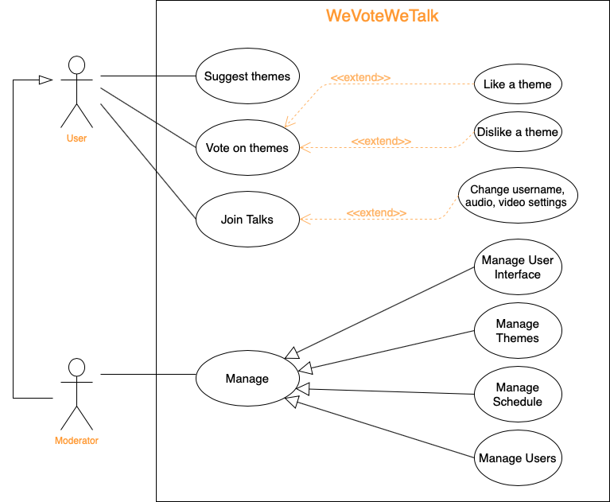

# openCX-*WeVoteWeTalk* Development Report

Welcome to the documentation pages of the *We Vote We Talk* of **openCX**!

You can find here detailed about the (sub)product, hereby mentioned as module, from a high-level vision to low-level implementation decisions, a kind of Software Development Report (see [template](https://github.com/softeng-feup/open-cx/blob/master/docs/templates/Development-Report.md)), organized by discipline (as of RUP): 

* Business modeling 
  * [Product Vision](#Product-Vision)
  * [Elevator Pitch](#Elevator-Pitch)
* Requirements
  * [Use Case Diagram](#Use-case-diagram)
  * [User stories](#User-stories)
  * [Domain model](#Domain-model)
* Architecture and Design
  * [Logical architecture](#Logical-architecture)
  * [Physical architecture](#Physical-architecture)
  * [Prototype](#Prototype)
* [Implementation](#Implementation)
* [Test](#Test)
* [Configuration and change management](#Configuration-and-change-management)
* [Project management](#Project-management)

So far, contributions are exclusively made by the initial team, but we hope to open them to the community, in all areas and topics: requirements, technologies, development, experimentation, testing, etc.

Please contact us! 

Thank you!

[Afonso Caiado](https://github.com/afonsocaiado)  
[Diogo Reis Diogo](https://github.com/DiogoReisrr)  
[João Ferreira](https://github.com/joaoferreira987)  
[José Eduardo Henriques](https://github.com/Zeze35H)  
[Ricardo Cardoso](https://github.com/ricardofdc)  

---

## Product Vision

We Vote We Talk - An online event running Open Space Technology, where participants choose what they want to talk about based on their personal interests.

---
## Elevator Pitch
We want to increase people's interest in an online conference event. What better way to do so than to talk about what people actually want to listen to? 
We let people say want they want to talk about, then vote on the ideas that were given and finnaly a moderator generates a schedule that best suits all the attendant's interests.
After that the talks begin! Any user is free to enter/leave any talk at any moment. Thanks to this there are two roles that a participant can have: bumblebees and buterflies. Bumblebees fly from group to group cross-pollinating the discussions while Butterflies sit around looking relaxed.
Interesting discussions emerge around them as people find them and pause to chat.

---
## Requirements

In this section, you should describe all kinds of requirements for your module: functional and non-functional requirements.

Start by contextualizing your module, describing the main concepts, terms, roles, scope and boundaries of the application domain addressed by the project.

### Use case diagram

Create a use-case diagram in UML with all high-level use cases possibly addressed by your module.

Give each use case a concise, results-oriented name. Use cases should reflect the tasks the user needs to be able to accomplish using the system. Include an action verb and a noun. 

Briefly describe each use case mentioning the following:

* **Actor**. Name only the actor that will be initiating this use case, i.e. a person or other entity external to the software system being specified who interacts with the system and performs use cases to accomplish tasks. 
* **Description**. Provide a brief description of the reason for and outcome of this use case, or a high-level description of the sequence of actions and the outcome of executing the use case. 
* **Preconditions and Postconditions**. Include any activities that must take place, or any conditions that must be true, before the use case can be started (preconditions). Describe also the state of the system at the conclusion of the use case execution (postconditions). 

* **Normal Flow**. Provide a detailed description of the user actions and system responses that will take place during execution of the use case under normal, expected conditions. This dialog sequence will ultimately lead to accomplishing the goal stated in the use case name and description. This is best done as a numbered list of actions performed by the actor, alternating with responses provided by the system. 
* **Alternative Flows and Exceptions**. Document other, legitimate usage scenarios that can take place within this use case, stating any differences in the sequence of steps that take place. In addition, describe any anticipated error conditions that could occur during execution of the use case, and define how the system is to respond to those conditions. 

### User stories

#### User Storie 1
As a participant,
I want to give my idea of a theme
so that other users can vote on my idea.

#### User Storie 2
As a participant,
I want to vote on the ideas I like the most
so that I can learn more about that topic.

#### User Storie 3
As a moderator,
I want to organize the schedule
so that most participants can hear the talks they most want to learn about.

#### User Storie 4
As a participant,
I want to be be able to leave and enter new talks
so that I'm not stuck in a talk I'm no longer interested in.

#### User Storie 5
As a participant,
I want to participate on a talk
so that the participants and the host can interact with each other.

---

## Architecture and Design
The architecture of a software system encompasses the set of key decisions about its overall organization. 

A well written architecture document is brief but reduces the amount of time it takes new programmers to a project to understand the code to feel able to make modifications and enhancements.

To document the architecture requires describing the decomposition of the system in their parts (high-level components) and the key behaviors and collaborations between them. 

In this section you should start by briefly describing the overall components of the project and their interrelations. You should also describe how you solved typical problems you may have encountered, pointing to well-known architectural and design patterns, if applicable.

### Logical architecture
The purpose of this subsection is to document the high-level logical structure of the code, using a UML diagram with logical packages, without the worry of allocating to components, processes or machines.

It can be beneficial to present the system both in a horizontal or vertical decomposition:
* horizontal decomposition may define layers and implementation concepts, such as the user interface, business logic and concepts; 
* vertical decomposition can define a hierarchy of subsystems that cover all layers of implementation.

### Physical architecture
The goal of this subsection is to document the high-level physical structure of the software system (machines, connections, software components installed, and their dependencies) using UML deployment diagrams or component diagrams (separate or integrated), showing the physical structure of the system.

It should describe also the technologies considered and justify the selections made. Examples of technologies relevant for openCX are, for example, frameworks for mobile applications (Flutter vs ReactNative vs ...), languages to program with microbit, and communication with things (beacons, sensors, etc.).

### Prototype
To help on validating all the architectural, design and technological decisions made, we usually implement a vertical prototype, a thin vertical slice of the system.

In this subsection please describe in more detail which, and how, user(s) story(ies) were implemented.

---

## Implementation
Regular product increments are a good practice of product management. 

While not necessary, sometimes it might be useful to explain a few aspects of the code that have the greatest potential to confuse software engineers about how it works. Since the code should speak by itself, try to keep this section as short and simple as possible.

Use cross-links to the code repository and only embed real fragments of code when strictly needed, since they tend to become outdated very soon.

---
## Test

There are several ways of documenting testing activities, and quality assurance in general, being the most common: a strategy, a plan, test case specifications, and test checklists.

In this section it is only expected to include the following:
* test plan describing the list of features to be tested and the testing methods and tools;
* test case specifications to verify the functionalities, using unit tests and acceptance tests.
 
A good practice is to simplify this, avoiding repetitions, and automating the testing actions as much as possible.

---
## Configuration and change management

Configuration and change management are key activities to control change to, and maintain the integrity of, a project’s artifacts (code, models, documents).

For the purpose of ESOF, we will use a very simple approach, just to manage feature requests, bug fixes, and improvements, using GitHub issues and following the [GitHub flow](https://guides.github.com/introduction/flow/).

---

## Project management

Software project management is an art and science of planning and leading software projects, in which software projects are planned, implemented, monitored and controlled.

In the context of ESOF, we expect that each team adopts a project management tool capable of registering tasks, assign tasks to people, add estimations to tasks, monitor tasks progress, and therefore being able to track their projects.

Example of tools to do this are:
  * [Trello.com](https://trello.com)
  * [Github Projects](https://github.com/features/project-management/com)
  * [Pivotal Tracker](https://www.pivotaltracker.com)
  * [Jira](https://www.atlassian.com/software/jira)

We recommend to use the simplest tool that can possibly work for the team.

---

## Evolution - contributions to open-cx

Describe your contribution to open-cx (iteration 5), linking to the appropriate pull requests, issues, documentation.

