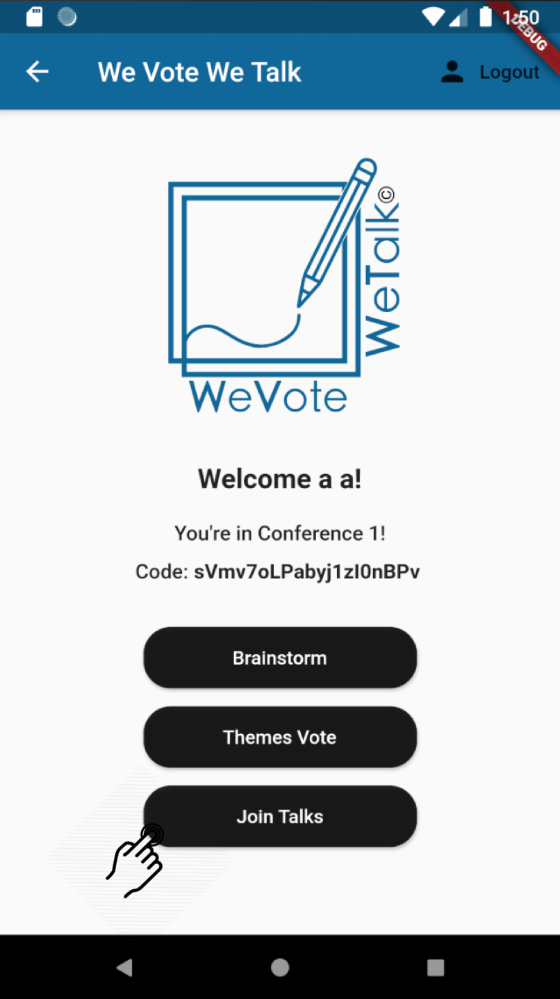
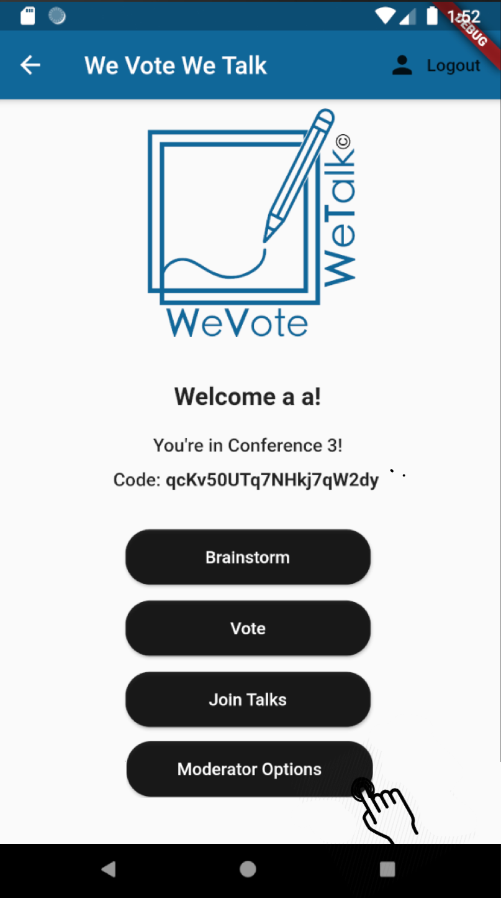
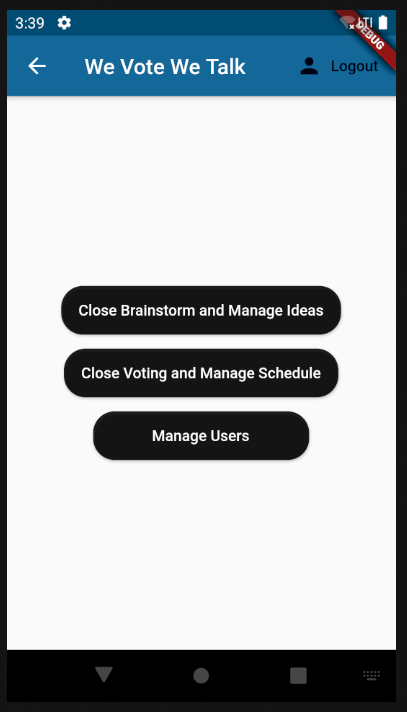
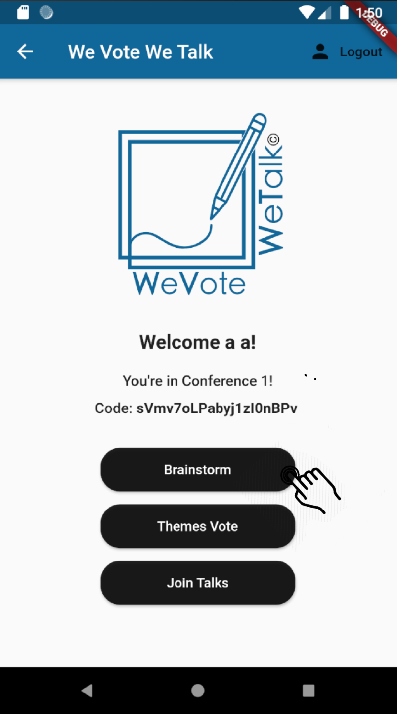
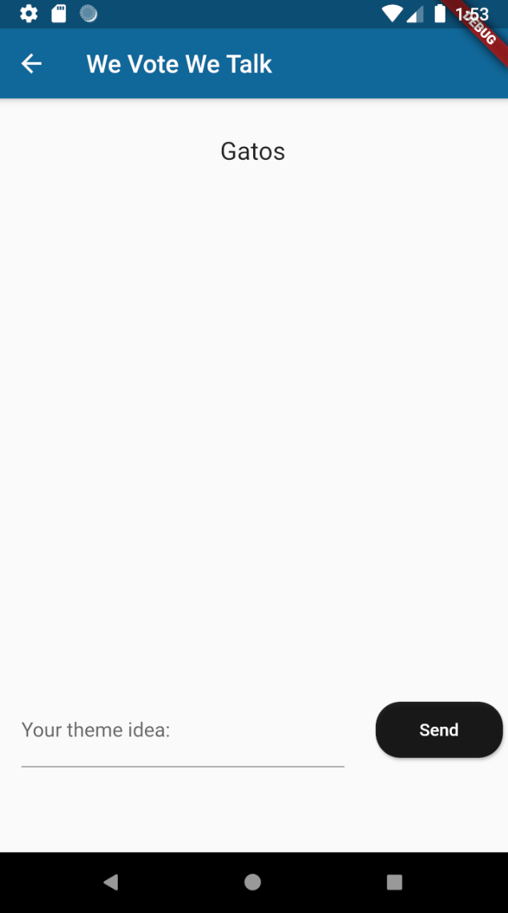
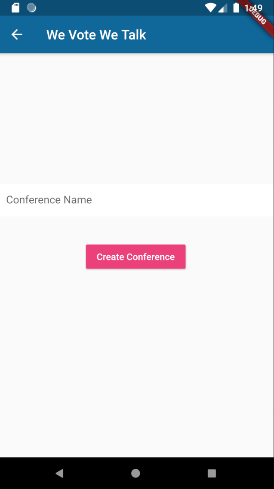

# openCX-*WeVoteWeTalk* Development Report

Welcome to the documentation pages of the *We Vote We Talk* of **openCX**!

You can find here detailed about the (sub)product, hereby mentioned as module, from a high-level vision to low-level implementation decisions, a kind of Software Development Report (see [template](https://github.com/softeng-feup/open-cx/blob/master/docs/templates/Development-Report.md)), organized by discipline (as of RUP): 

* Business modeling 
  * [Product Vision](#Product-Vision)
  * [Elevator Pitch](#Elevator-Pitch)
* Requirements
  * [Use Case Diagram](#Use-case-diagram)
  * [User stories](#User-stories)
  * [Domain model](#Domain-model)
* Architecture and Design
  * [Logical architecture](#Logical-architecture)
  * [Physical architecture](#Physical-architecture)
  * [Prototype](#Prototype)
* [Implementation](#Implementation)
* [Test](#Test)
* [Configuration and change management](#Configuration-and-change-management)
* [Project management](#Project-management)

So far, contributions are exclusively made by the initial team, but we hope to open them to the community, in all areas and topics: requirements, technologies, development, experimentation, testing, etc.

Please contact us! 

Thank you!

[Afonso Caiado](https://github.com/afonsocaiado)  
[Diogo Reis Diogo](https://github.com/DiogoReisrr)  
[João Ferreira](https://github.com/joaoferreira987)  
[José Eduardo Henriques](https://github.com/Zeze35H)  
[Ricardo Cardoso](https://github.com/ricardofdc)  

---

## Product Vision

We Vote We Talk - An online event running Open Space Technology, where participants are able to join talks based on their personal interests by voting from a group of talks to then generate a schedule with the top voted topics.

---
## Elevator Pitch

Have you ever been to an online Open Space event, and your concentration and interests level are slowly but surely fading away? What better way to increase your interest in the event than to talk about what you actually want to listen to? 
That's exactly what WeVoteWeTalk does: we want to increase people's interest in an online Open Space event. 
We let people say want they want to talk about, then vote on the ideas that were given and finnaly a moderator generates a schedule that best suits all the attendant's interests so that everyone's experience in the event is surely improved!
After that the talks begin! Any user is free to enter/leave any talk at any moment. Thanks to this there are two roles that a participant can have: bumblebees and buterflies. Bumblebees fly from group to group cross-pollinating the discussions while Butterflies sit around looking relaxed.
Interesting discussions emerge around them as people find them and pause to chat.

---
## Requirements

In this section, you should describe all kinds of requirements for your module: functional and non-functional requirements.

Start by contextualizing your module, describing the main concepts, terms, roles, scope and boundaries of the application domain addressed by the project.

### Use case diagram

 

##### Suggest Themes

* **Actor**: User
* **Description**: This use case's purpose is to allow the user to enter a theme that he would like to talk about.
* **Preconditions**: The user must have previously logged in or registered into his account for the app. 
* **Postconditions**: After he suggests a theme, the theme will appear in real time as an existing suggestion for all users.
* **Normal Flow**:
  1. The User logs in to his account.
  2. The User presses the brainstorm button to start suggesting themes.
  3. The User writes the theme he desires.
  4. The User presses the send button and the theme is suggested.
* **Alternative Flows and Exceptions**:
  1. The User logs in to his account.
  2. The User presses the brainstorm button to start suggesting themes.
  3. The User writes a theme that already exists in the themes list.
  4. The App rejects the theme and asks the user to rewrite.

##### Vote on Themes

* **Actor**: User
* **Description**: This use case's purpose is to allow the user to vote on themes that have already been suggested by users, and approved by moderators.
* **Preconditions**: The user must have previously logged in or registered into his account for the app. 
* **Postconditions**: After he votes on a theme, he can continue voting, or not.
* **Normal Flow**:
  1. The User logs in to his account.
  2. The User presses the vote button to start voting.
  3. The User likes the themes he desires to.
  4. The User keeps liking other themes, disliking already liked themes, or not.

##### Join Talks

* **Actor**: User
* **Description**: This use case's purpose is to allow the user to join the talk based on the theme he desires to.
* **Preconditions**: The user must have previously logged in or registered into his account for the app. 
* **Postconditions**: After he joins a talk, he can stay there for as long as it lasts, or leave whenever he wants.
* **Normal Flow**:
  1. The User logs in to his account.
  2. The User presses the Join Talks button.
  3. The User chosees the conference's theme he wants to hear or talk about.
  4. The User can (but is not obliged to) change some settings regarding the conference he is entering.
  5. The User presses the Join Meeting button.

##### Manage

* **Actor**: Moderator
* **Description**: This use case's purpose is to allow the moderator to manage everything he need to for the good functioning of the app.
* **Preconditions**: The moderator must have previously logged in or registered into his account for the app as a moderator. 
* **Postconditions**: He can decide whatever he wants to manage and take care of.
* **Normal Flow**:
  1. The Moderator logs in to his account.
  2. The Moderator presses the manage button.
  3. The Moderator chooses what he wants to manage on the app by clicking on it.

### User stories

#### Story 0 - Navigate the App
- **Story:** As a user, I want to login or register when I open the app to then see a Main Page and navigate around the app.
- **User Interface Mockups:**

  

- **Acceptance tests:**
```
  Scenario: User login fail
    Given I am on the login page
    When I type "valid@test.mail" in the email field
    And I type "wrongpassword" in the password field
    And I press the login button
    Then User is not logged in
```
```
  Scenario: User login
    Given I am on the login page
    When I type "valid@test.mail" in the email field
    And I type "validpassword" in the password field
    And I press the login button
    Then User is logged in
```
```
  Scenario: User register
    Given I am on the register page
    When I type "newemail@test.mail" in the email field
    And I type "newpassword" in the password field
    And I press the register button
    Then User is added to the database
```
- **Value and Effort:**
*Value:* Must have
*Effort:* 5

#### Story 1 - User interaction
- **Story:** As a participant, I want to participate on a talk so that the participants can interact with each other.
- **User Interface Mockups:**

 


- **Acceptance tests:**
```
  Scenario: User join talk
    Given I am on the main menu page
    When I press the join talks button
    And I press a theme button
    And I press the join meeting button
    Then User joined a talk on jitsi
```
- **Value and Effort:**
*Value:* Must have
*Effort:* 5

#### Story 2 - Prepare conferences
- **Story:** As a moderator, I want to organize the schedule so that most participants can hear the talks they most want to learn about.
- **User Interface Mockups:**

 

- **Acceptance tests:**
- **Value and Effort:**
*Value:* Could have
*Effort:* 10

#### Story 3 - Suggest themes
- **Story:** As a participant, I want to give my idea of a theme so that other users can vote on my idea.
- **User Interface Mockups:**

 

- **Acceptance tests:**
```
  Scenario: User sends theme idea
    Given I am on the main menu page
    When I press the brainstorm button
    And I type "testtheme" in the text field
    And I press the send button
    Then "testtheme" should be added to the theme list
```
- **Value and Effort:**
*Value:* Must have
*Effort:* 4

#### Story 4 - Voting
- **Story:** As a participant, I want to vote on the ideas I like the most, so that I can learn more about that topic.
- **User Interface Mockups:**

 


- **Acceptance tests:**
```
  Scenario: User votes on theme
    Given I am on the vote page
    When I press a "theme" button I like
    Then "theme" vote value should be incremented
```
- **Value and Effort:**
*Value:* Must have
*Effort:* 2

#### Story 5 - Enter / Leave Talks
- **Story:** As a participant, I want to be able to leave and enter new talks so that I'm not stuck in a talk I'm no longer interested in.
- **User Interface Mockups:**


- **Acceptance tests:**
```
  Scenario: User enters or leaves talk
    Given I am in a talk in jitsi
    When I press the hang up button
    Then User left a talk on jitsi
```
- **Value and Effort:**
*Value:* Must have
*Effort:* 1

#### Story 6 - Participate / Create Conferences
- **Story:** As a user, I want to participate / create in different conferences.
- **User Interface Mockups:**

   

- **Acceptance tests:**
- **Value and Effort:**
*Value:* Must have
*Effort:* 10

### Domain Model

 

## Architecture and Design

### Logical architecture

 

To represent our logical architecture we use a 3-layer representation.

In the first layer we have the Data Tier which represents how information is stored. 

The second layer, the Application Tier, presents what kind of information is processed and it's flow through the application.

Finally, the third layer called Presentation Tier shows everything that the user can see and/or interact with. 

### Physical architecture

 

Our project's physical architecture uses two blocks which communicate through HTTP:
* The client side block where the Flutter app is installed.
* The server side block which contains two Firebase Services, Firebase Cloud Firestore and Firebase Authentication.

We chose Firebase due to it's pre-built authentication capabilities and due to it's real-time synchronization which is necessary for a functioning voting system.  

### Prototype
To help on validating all the architectural, design and technological decisions made, we usually implement a vertical prototype, a thin vertical slice of the system.

In this subsection please describe in more detail which, and how, user(s) story(ies) were implemented.

---

## Implementation
Regular product increments are a good practice of product management. 

While not necessary, sometimes it might be useful to explain a few aspects of the code that have the greatest potential to confuse software engineers about how it works. Since the code should speak by itself, try to keep this section as short and simple as possible.

Use cross-links to the code repository and only embed real fragments of code when strictly needed, since they tend to become outdated very soon.

---

## Test

Currently we have automated tests for the following features:

* User Login
* Brainstorm
* Join Talks
* Voting

All the tests are implemented using a package for flutter named [gherkin_flutter](https://pub.dev/packages/flutter_gherkin) and are completely automated. The automated tests for this features can be seen [here](https://github.com/FEUP-ESOF-2020-21/open-cx-t5g1-wevotewetalk/tree/master/WeVoteWeTalk/we_vote_we_talk/Test).

Example of Login.feature running below.
 

---

## Configuration and change management

Configuration and change management are key activities to control change to, and maintain the integrity of, a project’s artifacts (code, models, documents).

For the purpose of ESOF, we will use a very simple approach, just to manage feature requests, bug fixes, and improvements, using GitHub issues and following the [GitHub flow](https://guides.github.com/introduction/flow/).


---

## Project management

Software project management is an art and science of planning and leading software projects, in which software projects are planned, implemented, monitored and controlled.

In the context of ESOF, we expect that each team adopts a project management tool capable of registering tasks, assign tasks to people, add estimations to tasks, monitor tasks progress, and therefore being able to track their projects.

Example of tools to do this are:
  * [Trello.com](https://trello.com)
  * [Github Projects](https://github.com/features/project-management/com)
  * [Pivotal Tracker](https://www.pivotaltracker.com)
  * [Jira](https://www.atlassian.com/software/jira)

We recommend to use the simplest tool that can possibly work for the team.


---

## Evolution - contributions to open-cx

Describe your contribution to open-cx (iteration 5), linking to the appropriate pull requests, issues, documentation.

